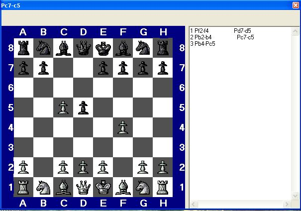



## CHESS

### Description

in this code using tree search method "alpha beta serach " to implement chess AI , but the king check ,castle and pawn prometion not implemented yet ....all legel moves for pawns bishops rooks queens knight kings are implemented ..kindly vote me ....
 
### More Info
 
mouse

             |
---                |---
**Submitted On**   |2006-12-28 18:56:16
**By**             |[ELBARUNI](https://github.com/Planet-Source-Code/PSCIndex/blob/master/ByAuthor/elbaruni.md)
**Level**          |Advanced
**User Rating**    |4.0 (24 globes from 6 users)
**Compatibility**  |VB 6\.0
**Category**       |[Internet/ HTML](https://github.com/Planet-Source-Code/PSCIndex/blob/master/ByCategory/internet-html__1-34.md)
**World**          |[Visual Basic](https://github.com/Planet-Source-Code/PSCIndex/blob/master/ByWorld/visual-basic.md)
**Archive File**   |[CHESS20396612282006\.zip](https://github.com/Planet-Source-Code/elbaruni-chess__1-67445/archive/master.zip)

